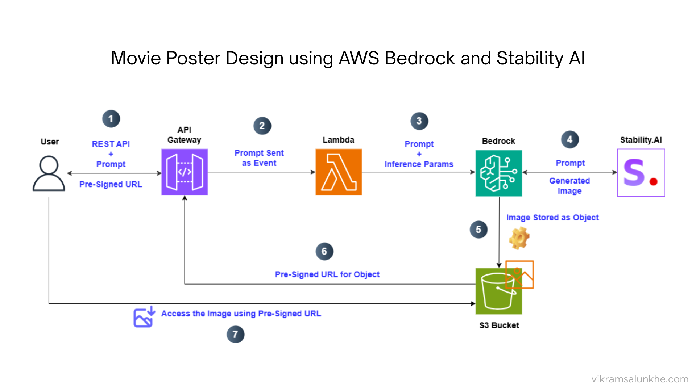

# Movie Poster Design Generator

A serverless application that generates custom movie posters using AWS Bedrock's Stable Diffusion XL model.

## Overview

This project leverages AWS Bedrock's generative AI capabilities to create custom movie posters based on text prompts. The application uses a Lambda function to process requests, generate images using Stable Diffusion XL, and store the results in an S3 bucket with a shareable pre-signed URL.

## Architecture



The solution uses the following AWS services:

- **AWS Lambda**: Processes requests and orchestrates the poster generation workflow
- **Amazon Bedrock**: Provides access to Stability AI's Stable Diffusion XL model for image generation
- **Amazon S3**: Stores the generated movie posters
- **AWS IAM**: Manages permissions between services

## Features

- Generate high-quality movie posters from text descriptions
- Customize image generation parameters (steps, scale, etc.)
- Automatically store generated posters in S3
- Generate time-limited pre-signed URLs for easy sharing

## Prerequisites

- AWS Account with access to Amazon Bedrock
- Permissions to create Lambda functions and S3 buckets
- Python 3.12+ and Boto3

## Setup Instructions

1. **Create an S3 bucket**:

   - Create a bucket named `S3_BUCKET_NAME` (Replace all instances of `S3_BUCKET_NAME` in the code with your actual S3 bucket name.)
   - Configure appropriate permissions

2. **Create a Lambda function**:

   - Runtime: Python 3.8+
   - Upload the provided `lambda_function.py` code
   - Set appropriate timeout (recommended: 30+ seconds)

3. **Configure IAM permissions**:

   - Ensure the Lambda execution role has permissions for:
     - `bedrock:InvokeModel`
     - `s3:PutObject`
     - `s3:GetObject`

4. **Enable Amazon Bedrock access**:
   - Request access to Stability AI's Stable Diffusion XL model in the AWS console
   - Verify model access in your account

## Usage

The Lambda function expects an event with a `prompt` parameter:

```json
{
  "prompt": "A fearless lone warrior stands on a rooftop of a futuristic city at night, gripping dual katanas glowing with neon light. Explosions erupt in the background as drones hover above, and the sky is lit with storm clouds and lightning. The city below is dystopian, filled with towering skyscrapers, holographic ads, and chaos in the streets. The warrior’s trench coat flaps in the wind, eyes glowing with determination. Bold cinematic lighting, dramatic atmosphere, hyper-realistic style."
}
```

### Example prompts:

- "A horror movie poster for 'Midnight Shadows', dark atmosphere, foggy forest, silhouette"
- "A romantic comedy poster for 'Love in Paris', bright colors, Eiffel Tower background"
- "An action movie poster for 'Ultimate Heist', explosive scene, dramatic poses, city skyline"

### Response:

The function returns a pre-signed URL to access the generated poster image:

```json
{
  "statusCode": 200,
  "body": "https://S3_BUCKET_NAME.s3.amazonaws.com/poster-2025-05-12-07-03-05.png?..."
}
```

## Customization

You can modify the image generation parameters in the Lambda function:

- `cfg_scale`: Controls how closely the image follows the prompt (default: 10)
- `steps`: Number of diffusion steps (default: 30)
- `seed`: Random seed for reproducibility (default: 0)

## Limitations

- The Lambda function has a maximum execution time (adjust timeout settings as needed)
- Image generation quality depends on the prompt specificity
- Pre-signed URLs expire after 1 hour (configurable)

## Acknowledgments

- This project uses Stability AI's Stable Diffusion XL model via AWS Bedrock
- Built with AWS serverless technologies
